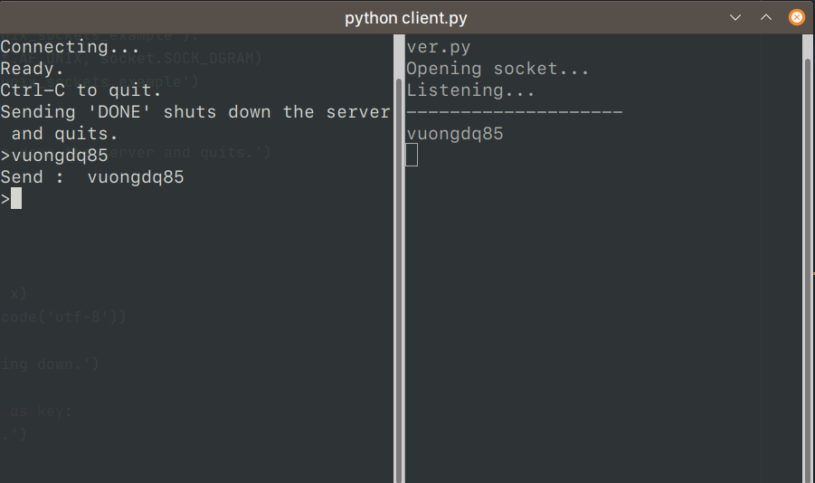

## Thư viện socket của python 3
### Tìm hiểu một số phương thức:

```text
bind(ip_address, port) : Dùng để lắng nghe đến địa chỉ ip và cổng
connect(ip_address) : Thiết lập một kết nối từ client đến server.
recv(bufsize, flag) : Phương thức này được sử dụng để nhận dữ liệu qua giao thức TCP.
recvfrom(bufsize, flag) : Nhận dữ liệu qua UDP
send(byte, flag) : Phương thức này để gửi dữ liệu qua TCP
sendto(bytes, flag) : Gửi dữ liệu qua UDP 
close() : Đóng một kết nối 
```

### Demo

